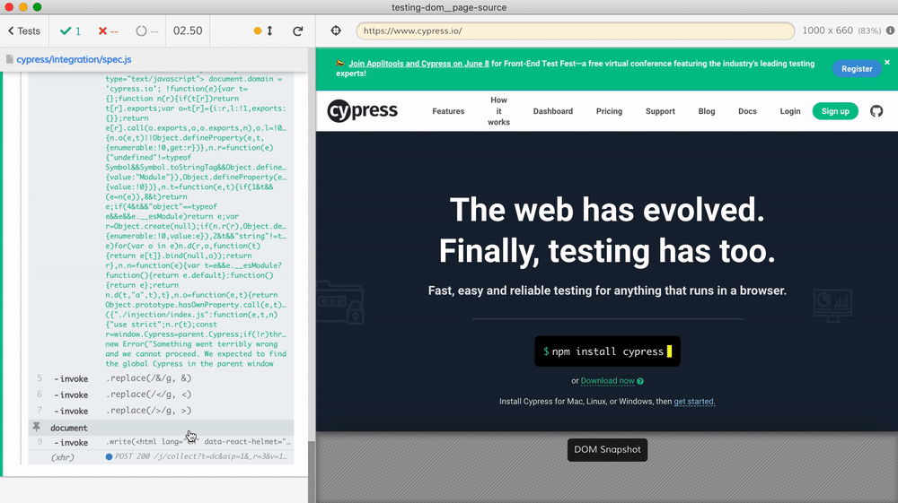

# Page source
> Get the source of the page under test

You can get the current document's HTML using `document.documentElement.outerHTML` property. Then you can validate / sanitize the HTML. You can even write it back as text into the current browser to see it, as [spec.js](./cypress/integration/spec.js) shows.
