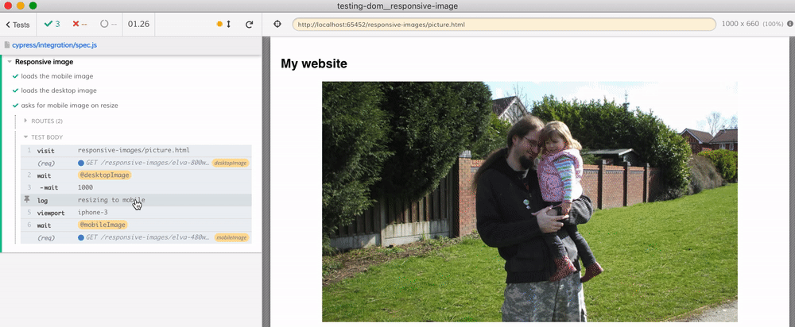

# Responsive image
> Testing how the browser loads images depending on viewport

The test in [cypress/integration/spec.js](./cypress/integration/spec.js) observes the images loaded by the `<picture>` element to confirm that the mobile version is requested for mobile viewport. The desktop viewport causes the page to request the desktop image version.



The loaded image resolution is confirmed using `naturalWidth` property.

```js
cy.intercept('elva-480w-close-portrait.jpg').as('mobileImage')
cy.visit('responsive-images/picture.html')
// the mobile image was loaded
cy.wait('@mobileImage')
// check the native resolution of the loaded image
cy.get('img').should('have.prop', 'naturalWidth', 480)
```

The folder [responsive-images](./responsive-images) copied from [mdn/learning-area](https://github.com/mdn/learning-area). The responsive HTML markup is described at [MDN: Responsive images](https://developer.mozilla.org/en-US/docs/Learn/HTML/Multimedia_and_embedding/Responsive_images)
