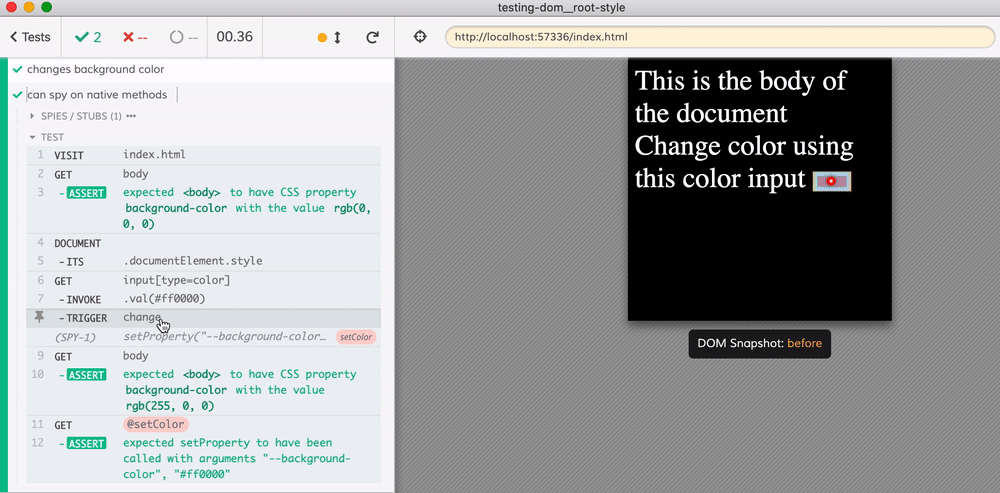

# Testing how the app sets the root document style variable

The application in [index.html](index.html) uses `<input type="color">` to set the CSS variable that controls the background style, see [app.css](app.css)

Find tests in [cypress/e2e/spec.cy.js](cypress/e2e/spec.cy.js) file.
