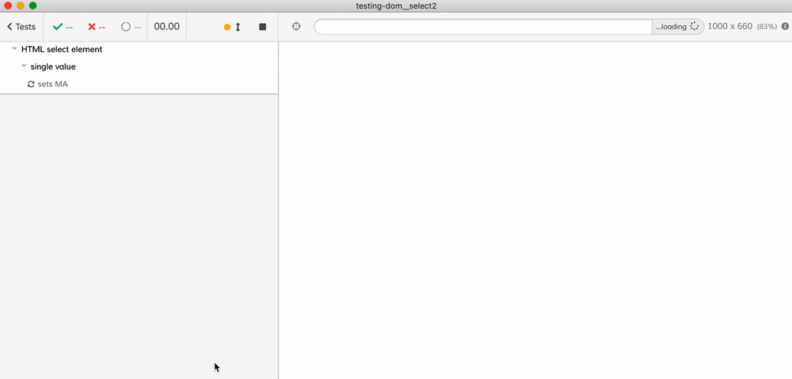

# testing-dom__select2
> Testing select elements and Select2 widgets

This example shows how end-to-end tests work with plain `<select>` HTML elements and with  [Select2](https://select2.org/) widgets. Read the blog post [Working with Select elements and Select2 widgets in Cypress](https://www.cypress.io/blog/2020/03/20/working-with-select-elements-and-select2-widgets-in-cypress/). For further discussion about flaky tests and "element detached from DOM" error, read the blog post [Do Not Get Too Detached](https://www.cypress.io/blog/2020/07/22/do-not-get-too-detached/).

Find all tests in the [cypress/integration/spec.js](cypress/integration/spec.js) file

- selecting a single value using `<select>`
- selecting multiple values using `<select>`
- selecting a single value using `Select2`
- selecting multiple values using `Select2`
- removing one of the selected values using `Select2`
- selecting a value from the list dynamically populated from Ajax call using `Select2`

