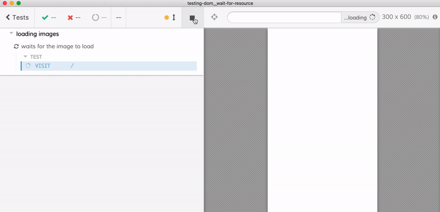
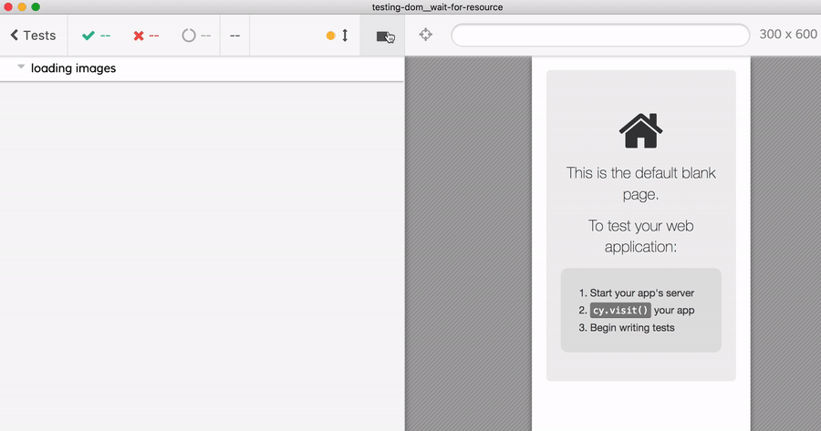
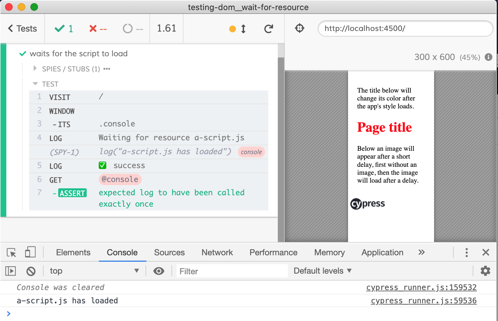

# Wait for resource to load
> Shows how to wait for delayed CSS to load before continuing with the test

## Delayed CSS resource load

The static page [public/index.html](public/index.html) has two CSS resources. The `base.css` loads synchronously using a link tag.

```html
<link rel="stylesheet" type="text/css" href="base.css" />
```

The second `app.css` resource loads dynamically using JavaScript

```js
setTimeout(() => {
  // now load dynamic style to apply to H1 element
  let link = document.createElement('link')
  link.rel = 'stylesheet'
  link.type = 'text/css'
  link.href = 'app.css'
  document.head.appendChild(link)
}, 1000)
```

Normally the functional tests do not check the element style. As long as the button is in the DOM, it can be clicked. But in this case we really would like to wait for the CSS files to load before the test continues.

## Custom command

From the [cypress/integration/spec.js](cypress/integration/spec.js) we wait for `base.css` and `app.css` to load before checking if the style from `app.css` has been applied to the page elements. The check for `app.css` is done by looking at the `performance` object that exists in the modern browsers.

```js
// how to check if a resource has been loaded
cy.window().then(win => {
  foundResource = win.performance
    .getEntriesByType('resource')
    .find(item => item.name.endsWith(name))
})
```

From the tests, we can call the above code wrapped in a custom command `cy.waitForResource`.

```js
// cypress/integration/spec.js
it('applies app.css styles', () => {
  cy.visit('/')
  cy.waitForResource('base.css')
  cy.waitForResource('app.css')
  // red color means the style from "app.css" has been loaded and applied
  cy.get('h1', { timeout: 250 }).should('have.css', 'color', 'rgb(255, 0, 0)')
})
```

The custom command `cy.waitForResource` is written directly in the spec file. Another custom command `cy.waitForResources` is coded in [cypress/support/index.js](cypress/support/index.js)

## 3rd party module

The [cypress/integration/spec.js](cypress/integration/spec.js) also includes a test that uses [cypress-wait-until](https://github.com/NoriSte/cypress-wait-until) 3rd party module with custom command `cy.waitUntil` to retry finding the performance entry with expected name.

## Delayed image

The spec file also shows how to ensure that an image has fully loaded.

```js
describe('loading images', () => {
  it('waits for the image to load', () => {
    cy.visit('/')

    // we can wait for the  element to appear
    // but the image has not been loaded yet.
    cy.get('[alt="delayed image"]').should('be.visible')

    // Let's wait for the actual image to load
    cy.waitForResource('cypress-logo.png')
  })
})
```



Alternatively, we can use `IMG.naturalWidth` or `IMG.naturalHeight` properties which are set when the image loads.

```js
// we can wait for the  element to appear
// but the image has not been loaded yet.
cy.get('[alt="delayed image"]')
  .should('be.visible')
  .and(($img) => {
    // "naturalWidth" and "naturalHeight" are set when the image loads
    expect(
      $img[0].naturalWidth,
      'image has natural width'
    ).to.be.greaterThan(0)
  })
```



## Delayed script

Similar to delayed style element, we can wait for delayed `<script src="...">` tag to finish loading its script.

```js
cy.visit('/')
cy.waitForResource('a-script.js')
```

